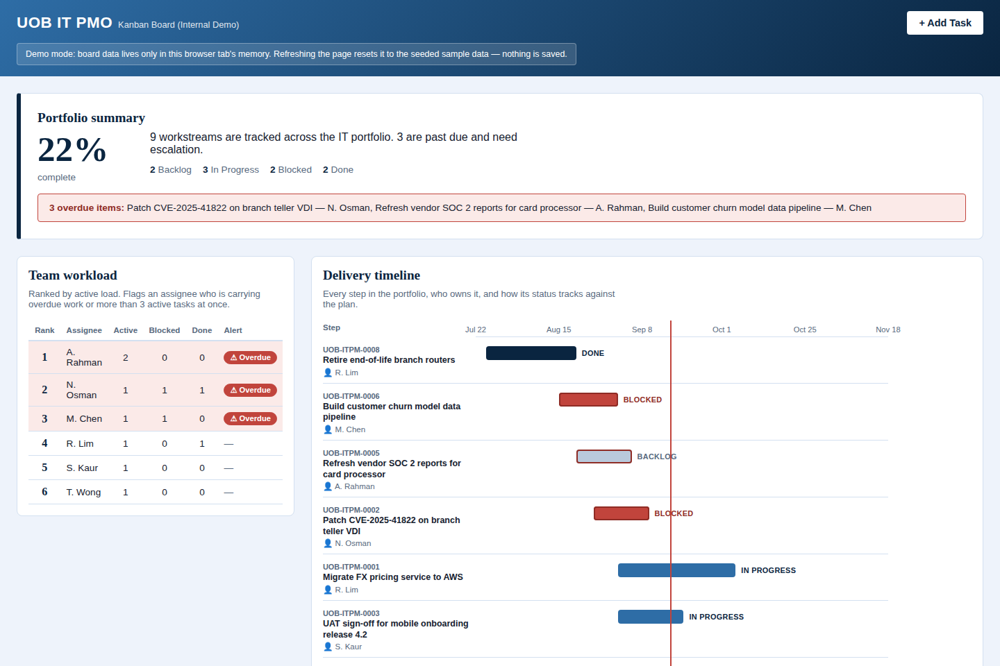

# UOB IT PMO Kanban Board (Internal Demo)

A single-file, vanilla HTML/CSS/JS Kanban board built as an internal demo/training tool. It is **not** an official UOB system — it uses a neutral text wordmark and generic corporate-blue styling only, never real UOB branding.

## Features

- Portfolio summary: a live completion figure, a computed narrative, and a callout of overdue items needing escalation
- Team workload ranking: assignees ranked by active load, flagged when overdue or carrying more than 3 active tasks
- Delivery timeline: a Gantt-style chart of every task's start-to-due span, colored by status, against a shared date scale
- Four fixed board columns: Backlog, In Progress, Blocked, Done
- Drag-and-drop cards between columns, plus a keyboard-accessible "Move ▸" dropdown on every card
- Add Task modal with client-side validation and optimistic UI updates
- Inline per-card delete confirmation (no native `confirm()` dialogs)
- Filter bar (project, assignee, priority)
- Responsive layout that stacks and scrolls appropriately below 768px

## Running it

No build step, no server, no dependencies. Just open `index.html` directly in a browser.

## Data & persistence

Board state lives only in memory for the current browser tab. Refreshing the page resets it to the seeded demo data — there is no `localStorage`, database, or backend beyond a single [FormSubmit](https://formsubmit.co) call used to email-notify on new task creation.

See [`CLAUDE.md`](CLAUDE.md) for architecture notes and constraints for anyone developing on this repo.

## Deployment

Pushes to the `claude/uob-it-pmo-kanban-yjv6vd` branch deploy the repo root to GitHub Pages via `.github/workflows/deploy-pages.yml` (GitHub Pages must be set to "Source: GitHub Actions" in repo settings).
